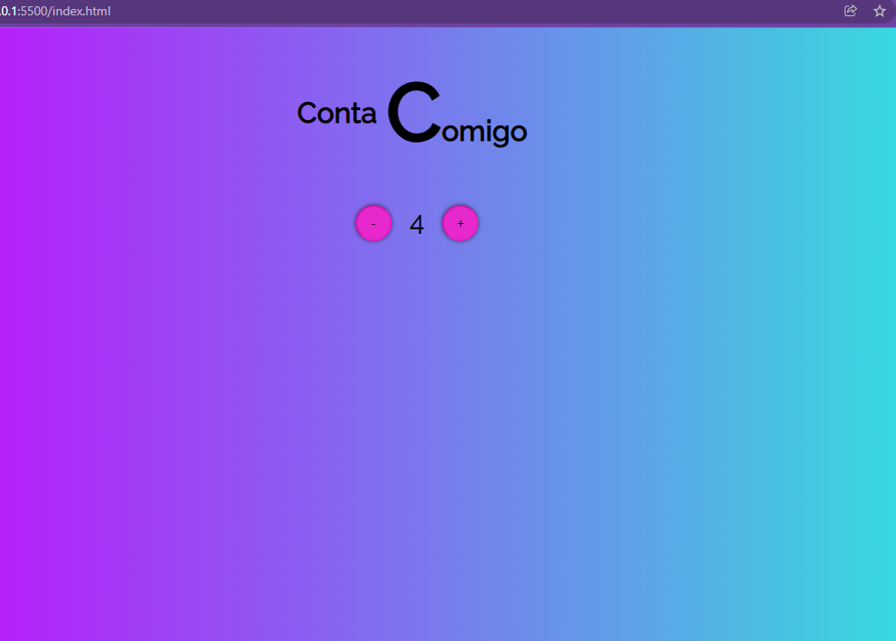

# Projeto_Aula-Desafio-Contador
<h2 >Introdução ao JavaScript</h2>

Aprendendo a me organizar.:rocket:

- [x] - Função Incrementar
- [x] - Função Decrementar
- [x] - Condição para chegar até certo número e desabilitar o botão
- [x] - Mudar a cor dos números negativos e positivos

